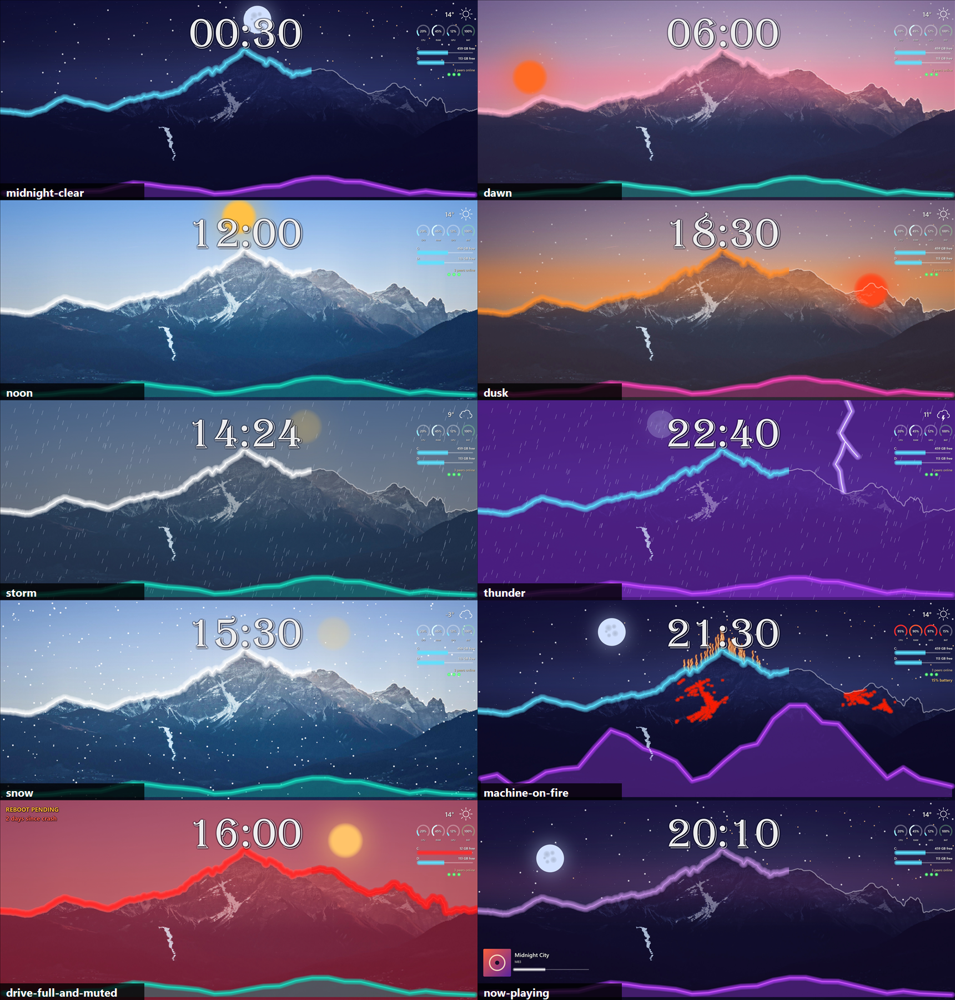

# Lane report: a photo per phase of the day (2026-09-30)

Brief: `2026-09-30-lane-photo-phase.md`. Branch `spike/photo-phase`, worktree
`D:\Source\Personal\DeskWall-photo`, on JOES-XPS-17 (i9-13900H). Nothing was published. Nothing
touched `%LOCALAPPDATA%\DeskWall`: every tick, gallery and measurement ran against a scratch home
under `%TEMP%`.

Commits:

| Commit | What |
|---|---|
| `e6034a0` | `scripts/phase-photos.ps1`: dawn, day and night grades of the dusk photo. |
| `4845ea4` | Bindable `baseImage` in Core, a 4-entry LRU `BaseCache`, the missing-file fallback, the designer photo row's bind chip and preview, and tests. |
| `92320ba` | `tick --measure` prints a `base` row. `--preview` takes `;`-separated sets that `--repeat` steps through. |
| `9e657bf` | `layouts/alpine-vision-photos.json` and the `layouts/README.md` note. `phase-photos.ps1 -AllowLive`. |
| `304d649` | This report, the gallery in `gallery-photos/`, `docs/layout-format.md` and `docs/architecture.md`. |

## 1. Bindable `baseImage`

- **Parsing.** `LayoutFile.BaseImage` is a `PropertyValue` now. A plain string still parses as a
  literal, so every existing layout loads unchanged, and it writes back as the same plain
  string. A string converts implicitly to a `PropertyValue`, so code that assigned a path still
  compiles.
- **Resolving.** `LayoutResolver.BaseImagePath(layout, tree)` reads the value as text, then
  passes it through `Paths.ExpandPath`, which handles both `runtime:` and `%ENV%`.
- **Where the tick resolves it.** `TickRunner` resolves the base before the skip gate, from the
  same tree as the components. `BaseCache.KeyFor` takes the *resolved* path. A phase change
  therefore moves the base key and gives a full render onto the new photo. Every other tick
  behaves exactly as before.
- **Missing file.** If the resolved file does not exist, the tick draws on the last base it
  drew (`FrameState.BasePath`). It sets `TickTimings.Warning` once, and records that in
  `FrameState.BaseMissing` so later ticks, skipped ones included, stay quiet. The record clears
  as soon as the path resolves to a real file again. `deskwall tick` prints the warning to
  stderr and the daemon logs it.
  - Checked through the CLI: `ridge-night.jpg` was removed and the ticks ran 12:00, 00:30,
    00:31.
  - Output: one line, `warning: base image ...\ridge-night.jpg not found; keeping
    ...\ridge-day.jpg`, on the 00:30 run only. All three ticks exited 0.
- **`BaseCache`.**
  - Raws are named `base/<w>x<h>-<key>.raw`.
  - A hit refreshes the file's mtime. Eviction is by that recency.
  - Writing a new raw keeps the 4 newest raws of that canvas size and deletes the rest.
  - Raws of other sizes, and the old unprefixed names, are deleted once they are a day old.
- **Docs.** `docs/layout-format.md` has a new section, "The base image". It covers the swap tick,
  the four cached photos, the missing-file rule, and the point that the sky-grade overlays are
  not needed once the photo itself changes.

## 2. The four photos

`scripts/phase-photos.ps1` writes `<home>\assets\alpine\ridge-{night,dawn,day,dusk}.jpg` at
3440x1440, JPEG quality 92, all from `Downloads\5168918.jpg`. The grading kernel is inline C#
run through System.Drawing; ImageMagick is not installed.

- **Sky/land mask.** The mask comes from the layout's own `ridge` bar shape. It is mapped into
  the bar's rect the same way `Surface.DrawPath` maps it, then feathered. No frame moves, so the
  trace lands on every grade. `-Check` writes half-size PNGs with that skyline drawn in red.
- **The grades:**
  - Night: cool and much darker. The snow is kept slightly brighter than the rest, as if under
    a moon. No stars; those come from the layout.
  - Dawn: a rose lift on the sky, strongest at the horizon, and a warm rim on the lit faces just
    below the ridge line.
  - Day: the warm cast is removed, the land is neutral and brighter, and the sky moves toward a
    pale blue.
  - Dusk: the photo as shot, re-encoded at the same size and quality.
- **Safety.** The script refuses the live runtime dir unless you pass `-AllowLive`. That switch
  exists for your own install and this lane never used it.

## 3. The layout

`layouts/alpine-vision-photos.json` is `alpine-vision.json` with two changes:

```json
"baseImage": { "bind": "time.phase | \"?night=runtime:assets/alpine/ridge-night.jpg,dawn=runtime:assets/alpine/ridge-dawn.jpg,day=runtime:assets/alpine/ridge-day.jpg,dusk=runtime:assets/alpine/ridge-dusk.jpg\"" }
```

- Every colour stop in `sky-grade`, `sky-top` and `sky-band` has its alpha halved, rounded up.
  For example, `sky-grade` at midnight goes from `#A01A1266` to `#501A1266`.
- `time.phase` was already on this branch, from the loud spike's Part A, so `TimeSource` was not
  touched and nothing is duplicated for the merge. The phase boundaries are the existing fixed
  day fractions: dawn 05:02, day 06:58, dusk 17:02, night 19:55.

## 4. Designer

- **Bind chip.** The Layout panel's photo row has the same Bind icon, bind chip and Unbind menu
  as any other property.
  - Binding adds the source if the layout does not already have it.
  - Undo labels are "Bind photo", "Unbind photo" and "Preview photo".
  - Unbind writes back the photo currently shown as a literal.
  - The chip is the path editor, so a hand-written phase map in the format field survives
    editing. The text editor's format presets would have dropped it.
- **Preview.** `PreviewRenderer` resolves the photo against the live tree, or the pinned one,
  and records it in `PreviewFrame.BaseImage`. The preview swaps photos as the tree changes, and
  the skyline trace uses the photo actually shown. The Settings page shows `bound: <binding>`.
- **Tests.**
  - Core: parse, resolve and round-trip of a bound base; a swap on a phase change; a missing
    file keeps the last good base and warns once; no previous base still fails the tick; LRU
    order per size.
  - Designer: a bound photo in the preview follows the live tree; the photo row binds, unbinds
    and undoes.
- **Totals.** `dotnet build` gives 0 warnings. `dotnet test`: Core 531 passed, Designer 593
  passed.

## 5. The gallery (Debug JIT build, 3440x1440, half size)



Command: `scripts\gallery.ps1 -Layout layouts\alpine-vision-photos.json -Out
docs\superpowers\plans\gallery-photos`. I seeded the gallery's scratch home with the four ridge
grades first, because the gallery copies only the repo's `assets`.

| Scene | Phase / photo | What you see |
|---|---|---|
| `midnight-clear` 00:30 | night | Deep blue-grey photo with the snow still faintly lit. The layout's stars and moon sit on a sky that is dark in the photo itself. The half-alpha indigo wash is barely needed. |
| `dawn` 06:00 | dawn | A rose horizon band and a pink cast on the peaks come from the photo. The layout's orange sun and pink ridge glow sit on top. |
| `noon` 12:00 | day | A clean blue sky and neutral grey rock. Much closer to a real midday than the dusk photo under a blue tint. |
| `dusk` 18:30 | dusk | The photo as shot: an amber sky and plum valley, plus the setting sun. |

The other six scenes each land on the photo for their own phase: storm and snow on day; thunder,
fire and now-playing on night; drive-full on day. The ridge trace lands in all ten.

## 6. Base swap cost (Debug JIT, 3440x1440, `--no-apply --no-shortcuts`)

Each run below is one process, `tick --repeat 4 --measure`, with no `--force`.

- **Cold swap:** `--preview "time.at=00:30;time.at=06:00;time.at=12:00;time.at=18:30"` with
  `base\` emptied first. Every run is a swap onto a photo not yet cached.
- **Warm swap:** the same command again, now that all four raws exist.
- **Same phase:** 12:00, 12:01, 12:02 and 12:03, with no swap. This is the ordinary minute tick
  for comparison.

Two rounds of each. Times are in ms; `base` is the part of `draw` spent in `BaseCache.Ensure`.

| Case | Run | draw (r1 / r2) | base (r1 / r2) | redrawn |
|---|---|---|---|---|
| cold swap | 1 (night; process cold) | 345 / 234 | 149 / 107 | 58 |
| cold swap | 2 (dawn) | 238 / 164 | 80 / 48 | 58 |
| cold swap | 3 (day) | 173 / 143 | 68 / 48 | 58 |
| cold swap | 4 (dusk) | 235 / 179 | 121 / 68 | 58 |
| warm swap | 1 (process cold) | 183 / 171 | 1 / 2 | 58 |
| warm swap | 2-4 | 82-124 / 102-112 | 0-1 | 58 |
| same phase | 1 (process cold) | 157 / 199 | 1 / 1 | 58 |
| same phase | 2-4 | 107-552* / 133-185 | 0 | 58 |

\* One 552 ms outlier in round 1, with no swap and no decode in it. It was machine noise, not
this code.

What the numbers mean:

- **A first-seen photo** costs 48-149 ms to decode, scale and write as a raw. This happens once
  per photo, per canvas size, per file mtime. The raws are on disk, so a daemon restart does not
  pay it again.
- **A cached photo** costs 0-2 ms in `Ensure`, which is only a stat. The raw is read inside the
  render.
- **A warm swap tick** draws in 82-124 ms, no more than the same-phase ticks around it
  (107-185 ms). On this layout every minute already redraws all 58 components, because the
  half-alpha sky layers blend on `time.dayFraction`. The swap therefore adds nothing measurable.
- **On a quieter layout,** whose ordinary minute is a clock-only incremental redraw, the swap
  tick is a full render. That is roughly the warm-swap figure, four times a day.
- **Encode** was 23-42 ms throughout.
- **Run 1 of every case totals 2.2-3.1 s.** That is the two PowerShell recipe sources starting
  cold during the source refresh, not the base.
- **Numbers are from a Debug JIT build** because the lane may not publish. Compare them with each
  other, not with the loud report's installed AOT figures.

## Deviations from the brief

1. **The LRU groups by canvas size.** The brief says "keeps up to 4 decoded bases". The designer
   shares the runtime dir and renders its preview at its own size, so a single global LRU of 4
   would let the preview evict the daemon's photos. Each size keeps 4; other sizes age out after
   a day.
2. **Literal paths also get the fallback.** A literal `baseImage` whose file disappears now keeps
   the last good base and warns once, instead of failing every tick. With no previous base it
   still fails, as before.
3. **New CLI surface for the measurements:** the `base` row in `--measure`, and `;`-separated
   `--preview` sets that `--repeat` steps through. Without them, a swap could only be measured
   across separate cold processes.
4. **`phase-photos.ps1 -AllowLive`.** The script is otherwise locked to scratch homes, so this
   lets you install the photos yourself.

## Concerns

- **The designer cannot author the map.** The chip binds `time.phase` in one click. The
  `?night=...,dawn=...` map, one photo per value, has to be typed into the format field. A
  per-value photo picker would be the natural next step and is not built.
- **The photos are not in the repo.** They are derived from a file in `Downloads` whose licence I
  do not know, so the layout depends on you running `phase-photos.ps1` into the runtime dir. The
  README covers this, and the missing-file fallback keeps the wallpaper up if a grade is missing
  after a first good tick. On a fresh runtime dir, though, the first tick fails until the photos
  exist.
- **The cut is hard.** The photo changes at a fixed phase boundary. The half-alpha sky layers
  still ease through the minutes on either side, but the photo itself cuts. The boundaries are
  fixed fractions, not sunrise and sunset for Leeds.
- **Disk.** `base\` now holds up to four 19.8 MB raws per canvas size, about 79 MB at
  3440x1440, instead of one.
- **`gallery.ps1` reads the live `widgets\` folder.** It copies `%LOCALAPPDATA%\DeskWall\widgets`
  into its scratch home. This is read-only, the behaviour already existed, and this layout uses
  no copies, but it is the one place the lane's tooling looked at the live dir. I did not
  change it.

## To try it live (not done here)

1. Run `.\scripts\phase-photos.ps1 -Home "$env:LOCALAPPDATA\DeskWall" -AllowLive`.
2. Copy the repo's `assets\alpine` into the same folder.
3. Point the display at `alpine-vision-photos.json`, then publish with `scripts\publish.ps1 -Aot`
   once this branch merges.
