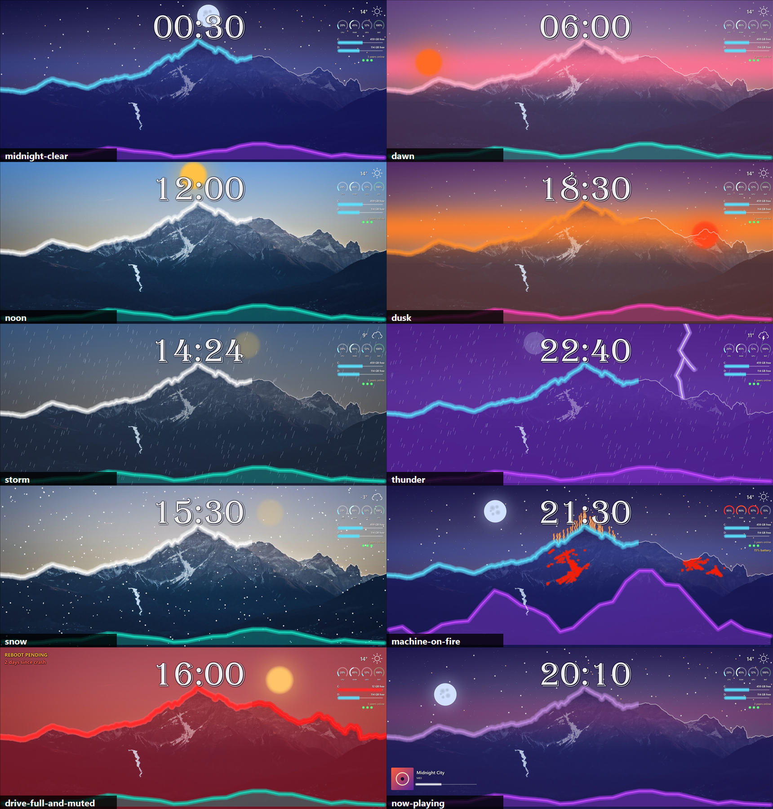

# Spike report: loud alpine layout (2026-09-30)

Brief: `2026-09-30-spike-loud-brief.md`. The design doctrine was off for this round. Every layer
was built loud, then judged against the gallery PNGs, not against taste.

Commits: Part A `cecf850` (`tick --preview`, `time.phase`, `scripts/gallery.ps1`), Part B
`2e83b38` (the loud `layouts/alpine-vision.json` plus the engine properties it needed), Part C
(this report, per-layer timing, the upscale filter change, `tick --canvas`, the installed-build
gallery).

## The gallery (installed AOT build, 3440x1440, half-size)



Rendered by `scripts\gallery.ps1 -Layout layouts\alpine-vision.json -Exe
"$env:LOCALAPPDATA\Programs\DeskWall\deskwall.exe"` against the published build. Single scenes
are in `gallery/<scene>.png`.

| Scene | What you see | Verdict |
|---|---|---|
| `midnight-clear` 00:30 | Deep indigo wash over the whole photo. About 400 stars, a few warm. The moon sits at its apex behind the clock, and the clock's shadow keeps the digits legible over it. Ice-blue ridge with a thick glow. Violet foothills along the bottom. | Mood change, not a tint. The moon behind the clock is the one collision (see dial-back). |
| `dawn` 06:00 | Rose band across the ridge line, and a low orange sun rising bottom-left. Pink ridge. Stars fading. Teal foothills. | Reads as dawn instantly. The rose band is the most saturated thing on screen. |
| `noon` 12:00 | Clear sky with a blue tint at the top. The gold sun is at its apex, behind the clock. White ridge and glow. | Closest to the bare photo, as intended. |
| `dusk` 18:30 | Amber-to-plum sky, and a red sun setting bottom-right on the ridge line (it stops at x 2860, clear of the right margin). Amber ridge. Magenta foothills. | Loudest scene of the ten. |
| `storm` 14:24 (code 63) | Darkened, desaturated sky. 600 diagonal rain strokes. The sun is veiled to 22 %. Rain-cloud icon in the margin. | Obviously raining without squinting. |
| `thunder` 22:40 (code 95) | Violet flash tint over the whole sky, a glowing lightning bolt right of centre, rain, and a veiled moon. | Loud. The bolt is the second thing you see. |
| `snow` 15:30 (code 75) | Snowfall dots at two sizes over everything. The sun is veiled. -3 degrees. | Clear. The dots are denser than the stars. |
| `machine-on-fire` 21:30 | The GPU and CPU snowfields go molten red. Heat shimmer (40 wavy orange strokes) rises off the main peak. The foothills are a violet mountain range peaking with CPU. All four dials are red. "15% battery" text. | The peaks look molten, as briefed. The foothills are at their loudest here. |
| `drive-full-and-muted` 16:00 | Deep-red wash over the whole photo, and the whole ridge plus its glow in red (muted). The C: bar is red with a glow ("12 GB free"). "REBOOT PENDING" and "2 days since crash" at 44 px, top left. | Looks *wrong* at a glance, which is the point. |
| `now-playing` 20:10 | Art at 200 px with an 8 px radius, a 40 px title, a 24 px artist and a glowing progress bar, bottom-left. Lilac ridge at twilight. | Legible from across the room. The progress bar is event-driven (below). |

## Tick cost

### Per tick, before and after (measured, not asserted)

| | Round 1 layout (26 components) | Loud layout (50 components, 57-58 drawn) |
|---|---|---|
| Warm draw, installed AOT build, `--repeat 4 --force --canvas 3440x1440` | 63-68 ms | 84-95 ms |
| Cold draw (first tick in the process) | 151 ms | 137-173 ms |
| Encode (JPEG) | 29-32 ms | 25-37 ms |
| Forced resolve | 1497-1663 ms | 1490-1705 ms |
| Live daemon, timer tick total, from `deskwall.log` | 146-238 ms (19:55-19:59) | 123-236 ms, typically about 165 (20:29-20:40) |

The heavy scenes, warm, on the installed build: `machine-on-fire` 90-101 ms, `thunder` 91-95 ms,
`snow` 91-95 ms. The gallery's own single cold ticks were 124-200 ms. The budget was 400 ms warm,
so there is headroom of more than 4x.

The forced resolve of about 1.5 s is the same as round 1's. It is the two PowerShell `command`
recipes (Playnite recent games, Tailscale peers) starting `powershell.exe`, not the layout. A
forced tick runs them every time; the daemon runs them only when their interval comes due. That
is why the live per-minute tick is about 165 ms, not 1.6 s.

The live ticks are currently at 1920x1200, because the machine is on an RDP session and the
layout store scales the layout. They will be larger on the ultrawide: see the draw numbers above,
which are forced to 3440x1440.

### Per layer, warm, installed AOT build (`deskwall tick --measure` now prints this)

Default scene (the real machine state at about 20:45, clear night):

| Layer | ms | | Layer | ms |
|---|---|---|---|---|
| moon | 7.1 | | sky-top | 2.9 |
| weather-1.sky (margin icon) | 6.1 | | sky-band | 2.6 |
| clock-1.clock | 6.0 | | ridge | 2.6 |
| gpu-snowfield | 4.8 | | sky-grade | 2.6 |
| cpu-snowfield | 4.1 | | moon-halo | 2.0 |

Everything else is under 2 ms. Layers at opacity 0 (a hidden sun, rain on a clear day, a tint
with alpha 0) cost nothing.

Scene peaks: `snow` sun 12.0, snow-small 7.1, sky-top 6.8. `thunder` rain 5.5. `machine-on-fire`
heat-shimmer 3.4, cpu-foothills 3.9. No layer comes near 60 ms.

### The one investigation: full-canvas image upscales

Before Part C, the first per-layer table showed sky-top at 45-59 ms and sky-band at 31-42 ms
(Release JIT build). Those layers are 8 x 512 gradient strips stretched over the canvas.
`Surface.DrawSurface` used `HIGH_QUALITY_CUBIC` for every image, and that filter's cost scales
with the destination area. It exists for downscales (CLAUDE.md: a 4x4 cubic rings when
downscaling). It adds nothing to a smooth gradient being stretched 400x.

Change: a pure upscale whose destination is at least 250,000 px (about 500 x 500) now draws
with linear interpolation. Icon-sized upscales keep the good filter; the `image-fits` and
`repeater-auto` goldens failed when *every* upscale went linear, which is why there is an area
floor. Result: sky-top 50 -> 3-5 ms and sky-band 35 -> 3-5 ms, taking the warm draw on the JIT
build from 160-206 ms to 86-143 ms. The dawn and night renders were checked after the change;
the gradients are still smooth.

The brief's other suggestion, caching geometry with thousands of figures as one
`PathGeometry`, was not needed: the 400 stars cost 5.8 ms in total over four layers, and the 600
rain strokes cost 5.5 ms.

## What I would dial back first, and why

The ordered list (sky washes, saturation, red wash, foothills, rain, sun/moon apex) is in #53.

## Notes

- **Media progress is event-only.** `media.progress`, `media.position` and `media.duration` update
  on the session's `TimelinePropertiesChanged` (acted on only for a seek of more than 3 s or a
  changed end time), and on media-property and playback-state changes. There is no polling, so the
  bar sits still while a song plays and jumps on the next event. That is the brief's "poll-free"
  constraint, not a bug.
- **RDP and the gallery.** `tick --layout` does not go through the layout store, so from an RDP
  session (1920x1200) it drew the 3440x1440 layout unscaled and cropped. This happened
  mid-session. `tick --canvas WxH` (new) stands in for the primary display's size, and
  `gallery.ps1` passes `--canvas 3440x1440` by default (`-Canvas` overrides it). It requires
  `--no-apply --no-shortcuts`.
- **Shortcuts warning in the live log** ("desktop folder view is unavailable") has been logged
  since 2026-09-28 during RDP sessions. It is not related to this layout.

## New engine surface from this spike

Documented in `docs/layout-format.md` and `docs/sources.md`:

- `deskwall tick --preview key=value,...`, which pins source values after the refresh, and
  `deskwall tick --canvas WxH`.
- `time.phase` (`night|dawn|day|dusk`).
- Image `tint` (a white asset recoloured by a bound colour; alpha 0 skips the draw).
- Bar `opacity` (multiplies track, fill and glow) and `glowStrength`.
- Line `areaFill`, `glowColor` and `glowStrength`.
- `media.position`, `media.duration`, `media.progress`, and the Tailscale recipe's `count`.
- `tick --measure` prints a per-layer draw table, dearest first (`TickTimings.LayerTable`).
- `Surface.DrawSurface` draws large pure upscales with linear interpolation.

## Live state and revert

The live daemon (`%LOCALAPPDATA%\Programs\DeskWall`, AOT, published from this tree) runs
`%LOCALAPPDATA%\DeskWall\column-system.json` = `layouts/alpine-vision.json`. The first tick
after the swap was `tick LayoutChanged (posted): redrawn 57 total 1663 ms`, and the timer ticks
after it were clean.

Revert to round 1 (the earlier `before-*` backups are untouched):

```powershell
Copy-Item "$env:LOCALAPPDATA\DeskWall\column-system.before-loud.json" "$env:LOCALAPPDATA\DeskWall\column-system.json" -Force
```

The layout watcher picks it up within a second; no restart is needed.
