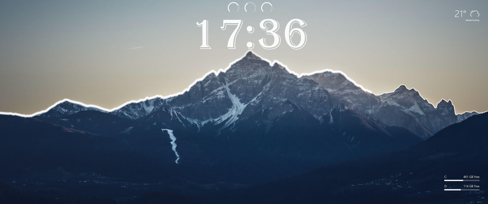
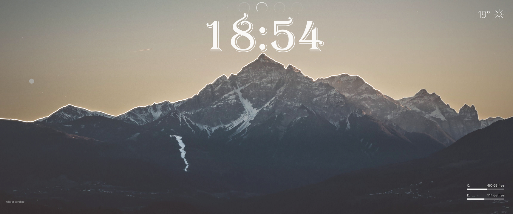

# Alpine vision spike, 30 September 2026

## Part 1 checkpoint

Shipped day/night grade, skyline-clipped stars, mute indication, conditional reboot/crash text,
battery, hardware histories and `line`, event-driven media with cached PNG art, and live rules
with colour swatches. Native AOT publish succeeded and the live layout was installed.

Baseline forced tick: resolve 461 ms, draw 231 ms, encode 32 ms, total 727 ms, CPU 297 ms,
load 104 ms. Part 1 scratch forced tick: resolve 542 ms, draw 127 ms, encode 30 ms,
total 701 ms, CPU 312 ms, load 45 ms. These are one-shot processes, not resident warm timings.

The three original dials were day/week/year, despite the brief calling them hardware.
Replaced that linked copy with explicit CPU/RAM/GPU dials plus battery. The clock is preserved.
CPU temperature is unavailable by project design; no fabricated temperature will be shown.
Desktop folder view currently reports unavailable; shortcut verification remains for Part 2.

Part 1 result: [2026-09-30-spike-part1.png](2026-09-30-spike-part1.png).

## Part 2: the landscape as the instrument

Live since 18:53:52 on JOES-XPS-17: `layouts/alpine-vision.json` copied over
`%LOCALAPPDATA%\DeskWall\column-system.json`. The daemon picked it up on save
(`tick LayoutChanged (posted): redrawn 33`) and every timer tick since has been clean.

| Before the spike | After Part 2 |
|---|---|
|  |  |

The "after" image was taken at 18:54 BST, in the dusk grade: the sun has set, the moon has
risen on the left, the ridge glow has warmed to amber and the Tailscale text has gone. At
that moment the weather was clear, the GPU and CPU were cool, no drive was over 85 per cent and
Playnite is not installed on this machine, so the fog, rain, snow, red snowfields, red sky and
cairns are all correctly invisible. In this pass I forced both snowfields to their full-heat
colour in a scratch home and checked the render: the red lands on the snow of both peaks and
nowhere else. The other overlays were checked by the agent that built them (the section 6 to 10
commits), not again here.

### What shipped

Section 6, bindable geometry. `x`, `y`, `w` and `h` can each be bound (a literal `rect` is the
fallback), and the resolver, `LayoutScaler`, content keys, the designer's geometry rows and widget
copies all follow. A copy now adds its own offset to a bound x or y, and moving a part inside a
copy no longer writes a stray `x`/`y` override next to the `rect` one. The sun (white to amber
disc) arcs across the sky on `time.dayFraction`; the moon takes its slot at night. The ridge glow
colour is white by day, amber at dusk and ice-blue at night.

Section 7, weather on the mountain. Fog, rain and snow layers bound by Step rules on the Open-Meteo
`weather_code`; all faint. The main peak's snowfield turns red with GPU temperature
(`hardware.gpuTempFraction`, 0 at 0.5, about 45 per cent at 0.9). The second peak has its own
snowfield (`cpu-snowfield`, traced at 4 px cells, luminance above 0.44, sky excluded, 142 runs).
**Decision:** there is no CPU temperature by design, so it is bound to `hardware.cpu`, the
five-minute average load, as an honest heat proxy with the same 0.5 to 0.9 ramp. It never fakes
a temperature.

Section 8, the job statement. `disks.worstUsedFraction` drives a full-screen deep-red wash from
0.85 used. `scripts/playnite-recent.ps1` reads a temp copy of Playnite's `games.db` with Playnite's
own LiteDB and feeds a pair of cover-and-shortcut repeaters low in the right margin. When
Playnite is missing, as on this machine, it prints `status: unavailable` with no games rather than
failing, so the cairns are simply absent.

Section 9, the designer as a drawing tool. A pen tool: click to add points, Enter drops an open
shaped bar and double-click closes a filled one (the double-click no longer adds a duplicate last
point). A trace tool: drag a band and `Render/SkylineTrace.cs` walks the luminance edge. The same
code backs `deskwall trace <photo> x y w h <out.json>`. The rules editor has colour swatches and
live preview; its swatch popup now follows the designer theme.

Section 10, ambient details. Tailscale peers are warm-white round-cap stubs on the valley floor,
one per online peer (two tonight), fed by `scripts/tailscale-peers.ps1`. The ski piste is a traced
filled path whose alpha blends on `system.uptime`: bright after a boot, faint after a week.

Also in this pass:
- The battery dial fades on mains at full charge, using a new dial `opacity`.
- `FrameRenderer` skips a bar whose fill and track are both fully transparent, which is what
  every weather and warning overlay is most of the time.
- `deskwall tick --repeat N` measures warm ticks in one process.
- Due sources now refresh side by side (see below).
- The test suite is back to green (1,105 passing).

### What was dropped, and why

- **Contrail and minute hand**: the brief itself vetoes both (doctrine: leave the plane alone; do
  not animate the clock). Not built.
- **CPU temperature**: unavailable by design. The CPU snowfield uses load instead (see above).
- **Cairns on this machine**: Playnite is not installed on JOES-XPS-17, so the repeater has
  nothing to show. The layout and script are ready for JOES-PC.
- **`vpn-1` text copy**: replaced by the valley lights, as the brief asks.

### Shortcut verification

`deskwall verify` exits 4 (`RESULT: FAIL`) with `(no shortcut components in the layout)`. That is
the verifier refusing to pass zero slots, not a padding error: with Playnite absent the cairn
repeater resolves no shortcuts. Separately, the daemon has logged `the desktop folder view is
unavailable` on every tick all day, before and after this layout, so icon placement cannot be
measured from this session either way. Verifying the cairns on JOES-PC: #65.

The verify screenshot of the right column (`%LOCALAPPDATA%\DeskWall\verify-desktop.png`) matches
the composed frame pixel for pixel in the band checked, including the Part 1 CPU-history
foothills line at y 985. With the CPU steady and idle that line is flat, which is correct: it is a
history, not a decoration.

### Tick cost

AOT build `65177b2`, JOES-XPS-17, `deskwall --home <scratch> tick --layout <layout> [--force]
--measure --no-apply --no-shortcuts --repeat 4`, 12 s apart. Times in milliseconds.

| Layout | Tick | resolve | draw | encode | total | CPU | redrawn |
|---|---|---|---|---|---|---|---|
| Before (Part 1 live) | forced, cold | 457 | 137 | 27 | 623 | | |
| Before (Part 1 live) | forced, warm | 86-94 | 71-79 | 28-34 | 194-201 | | 22-23 |
| Before (Part 1 live) | unforced, nothing changed | | | | 0-2 | | skipped |
| After (Part 2 final) | forced, cold | 1990 | 135 | 38 | 2167 | | |
| After (Part 2 final) | forced, warm | 1495-1525 | 61-69 | 27-32 | 1586-1629 | 125-156 | 33-34 |
| After (Part 2 final) | unforced, nothing changed | 4-7 | | | 4-7 | | skipped |
| After (Part 2 final) | unforced, clock changed | 7 | 113 | 31 | 154 | 141 | 34 |

The live daemon agrees: `tick Timer: redrawn 33 total 169 ms cpu 172 ms` each minute. The Part 1
layout logged 154 to 175 ms each minute. With both red snowfields forced visible (two shapes of well over a hundred run rectangles each), a forced tick drew in 117 ms.

**Gate: passed.** Warm draw is 61 to 113 ms against the brief's 400 ms limit, so no layer was
disabled. Part 2 added 13 components (26 against 13) and draw is no slower, because the
invisible overlays are skipped rather than painted. A skipped tick's resolve went from 0-2 ms to
4-7 ms.

The forced resolve is the one big number, and it is not drawing. It is two `command` recipes
(Playnite and Tailscale) that each start `powershell.exe`, about 1.3 s and 1.5 s. They used to
run one after the other (forced resolve about 3.1 s). `TickRunner` now starts every due refresh
before awaiting any, which halved it to the slower of the two. It is paid only when those
sources are due (every 300 s), or on a forced tick, and it is wall time spent waiting on a child
process, not tick CPU. The per-minute tick does not pay it.

### Revert

The layout backups are untouched and each is one copy away:

```powershell
$rt = "$env:LOCALAPPDATA\DeskWall"
Copy-Item "$rt\column-system.before-spike.json" "$rt\column-system.json" -Force   # before the whole spike
Copy-Item "$rt\column-system.before-part2.json" "$rt\column-system.json" -Force   # back to Part 1
```

`column-system.before-ridge.json` is also still there. The daemon repaints on save. Part 2 also
added `assets\alpine\` and `scripts\` (the Playnite and Tailscale recipes) to the runtime dir.
Nothing else reads them, so they can stay or be deleted after a revert.